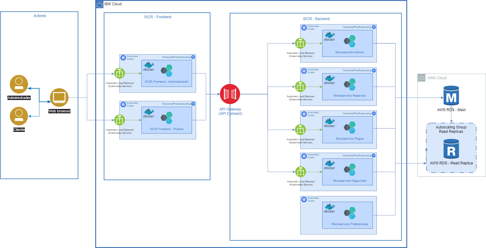

# SICR
Sistema Integrado de Cadena de Restaurantes.

## Descripción

Sistema que simula la atención de una cadena de restaurantes y sus diferentes sedes, así mismo su atención de clientes via on-line.
Implementación de arquitectura de microservicios elaborada en Java (Springboot Framework) y C# (.NET Framework), para el frontend se usó Angular.

Diseñado para ejecutar los microservicios contenerizados en imágenes Docker y estas a su vez orquestadas en Kubernetes para balanceo de cargas.

Desplegado sobre IBM Cloud, arquitectura diseñada cumpliendo atributos de calidad tales como elasticidad, escalabilidad y mantenibilidad (ISO 25010).

___Vista física.___  Diagrama de la arquitectura de la solución

## Autores

Nicolás David Cubillos Cubillos

Esteban Alberto Rojas Molina

Angello Mateo Jaimes Rincón
